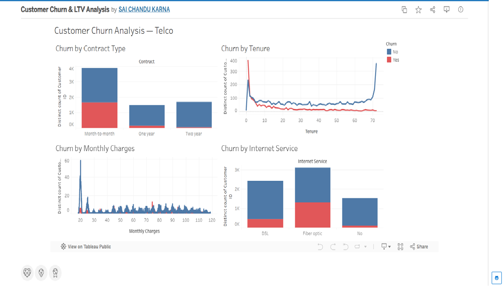

# Customer Churn & Lifetime Value (LTV) Analysis

A SQL + Python analysis that identifies why customers cancel, segments them by
value, and highlights revenue at risk through an interactive Tableau dashboard.

**Tech:** SQL · Python (Pandas, NumPy) · Tableau · Snowflake

### 🔴 [View the Live Interactive Dashboard on Tableau Public »](https://public.tableau.com/app/profile/sai.chandu.karna/viz/CustomerChurnLTVAnalysis/CustomerChurnAnalysisTelco)



---

## Overview

Retaining a customer is far cheaper than acquiring one, so understanding *who*
churns and *why* is high-leverage work. This project analyzes a customer base to
find the primary drivers of cancellation, segments customers by contract type,
tenure, and lifetime value, and delivers the findings to product teams in a
dashboard that pinpoints where revenue is at risk.

## Key Insights

- **Contract type is the strongest churn driver** — month-to-month customers churn
  dramatically more than one- or two-year contract holders.
- **Early tenure is the danger zone** — churn is highest in the first 1–5 months,
  then drops sharply as customers stay longer.
- **Higher monthly charges correlate with higher churn** — customers on premium
  plans leave more often.
- **Fiber-optic internet customers churn more than DSL customers**, pointing to a
  possible service-experience issue.

## Dataset

- **7,000+ customer records** sourced from Snowflake.
- Reproducible with the public
  [Telco Customer Churn dataset (Kaggle)](https://www.kaggle.com/datasets/blastchar/telco-customer-churn).

## Approach

1. **Data sourcing (Snowflake + SQL):** Pulled the customer dataset and joined
   demographic, billing, and contract attributes.
2. **Cleaning & standardization (Python):** Wrote reusable Pandas/NumPy scripts
   to standardize demographic and billing fields — cutting prep time.
3. **Driver analysis (SQL + Python):** Explored the relationship between churn
   and contract type, tenure, and monthly charges.
4. **Segmentation & LTV:** Segmented customers by contract type, tenure, and
   lifetime value to quantify revenue at risk.
5. **Visualization (Tableau):** Built an interactive 4-view dashboard highlighting
   at-risk segments and revenue exposure.

## Key Results

- Analyzed **7,000+ customers** to surface the top drivers of cancellation.
- Built a Tableau dashboard segmenting users by **contract type, tenure, monthly
  charges, and internet service**.
- **Cut data-preparation time by ~30%** with reusable standardization scripts.

## Repository Structure

```
.
├── notebooks/            # analysis + cohort work
├── data/                 # sample data (or link in README)
├── dashboard/            # Tableau workbook (.twbx) or Tableau Public link
├── screenshots/          # dashboard images
└── README.md
```

## Author

**Sai Chandu Karna** — Data Analyst
[LinkedIn](https://www.linkedin.com/in/saichandukarna) · [Tableau Public](https://public.tableau.com/app/profile/sai.chandu.karna) · saichandu0689@gmail.com
